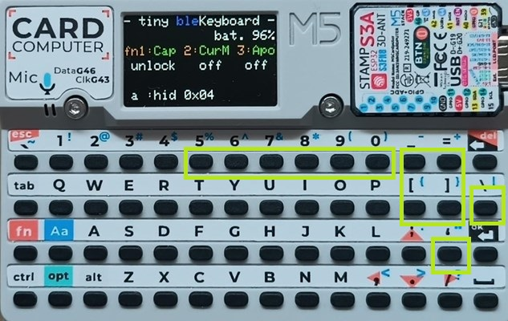

# tiny-bleKeyboard-Cardputer
**[` 日本語 `](README_jp.md)**

# Bluetooth Keyboard for Cardputer User Manual

## 0.Change history

*   v101 2025-06-07
    * initial release
*   v102 2025-06-08
    * Removed `Insert` and `PrintScreen` Keys from Cursor Movement Mode
---

## 1. Introduction

This software (`tiny-bleKeyboard`) is for using the M5Stack Cardputer as a Bluetooth keyboard.
All printed keys are implemented. We've also implemented other useful keys. So you can use the Cardputer as a nearly standard tiny Bluetooth keyboard.

Main features:
*   Standard key input, sending modifier keys (Shift, Ctrl, Alt, Opt)
*   Special functions in combination with the Fn key
    *   Toggle CapsLock (Fn + 1)
    *   Toggle cursor movement mode (Fn + 2)
    *   Set auto power-off (APO) time (Fn + 3)
*   Power saving features
    *   Screen brightness reduction after a period of inactivity
    *   Transition to deep sleep after APO warning if set time elapses
    *   Transition to deep sleep after warning display when battery is low
*   Status confirmation via screen display

## 2. Startup and Screen Display

### Startup
When the Cardputer is powered on, the software will start.
If the 'a' key is pressed during startup, it will proceed to the application switching menu for BIN files on the SD card (see "7. Switching Applications" for details).

### Screen Display Layout
The screen consists of 6 lines and displays the following information:

*   **L0 (1st line): Title and Bluetooth connection status**
    *   Example: `- tiny bleKeyboard -`
    *   The color of the word `ble` indicates the connection status (Blue: connected, Red: not connected)
*   **L1 (2nd line): Battery level**
    *   Example: `            bat. 76%`
*   **L2 (3rd line): Fn key function guide**
    *   Example: `fn1:Cap 2:CurM 3:Apo`
*   **L3 (4th line): Current status of Fn key functions**
    *   CapsLock status (Example: `unlock` / `lock`)
    *   Cursor movement mode status (Example: `off` / `on`)
    *   APO set time (Example: `20min` / `off`)
*   **L4 (5th line): Modifier key status / Power saving warning**
    *   Pressed modifier keys (Example: `Shift Ctrl Alt Opt Fn`)
    *   During APO warning: `     SLEEP TIME     ` (blinking)
    *   During low battery warning: `    LOW BATTERY !!  ` (blinking)
*   **L5 (6th line): Sent key information**
    *   Input character and HID code (Example: when `a` is pressed, `a :hid 0x04`)
    *   HID code only when a special key is sent (Example: when `ENTER` is pressed, `hid 0x28`)

## 3. Basic Usage

### Bluetooth Pairing
1.  Turn on the Cardputer.
2.  Open the Bluetooth settings screen on the host device (PC, smartphone, etc.) you want to connect to, find a device name like `ESP32 Keyboard`, and perform pairing.
3.  When pairing is successful, the `ble` text on screen L0 will change from **red to blue**.

Once pairing is complete, the connection status is continuously monitored while active. It will attempt to reconnect if the connection is lost. You can check the current connection status by the color of `ble`.

### Key Input and Host Device Drivers
Characters typed on the Cardputer keyboard are sent to the paired host device (PC, smartphone, etc.).
Please use an `English layout keyboard driver` on the host device.

If a `Japanese keyboard driver` is used, some characters may differ.
Refer to "9. Links: Using an English Keyboard with a Japanese Driver" for necessary adjustments.

### Modifier Keys
The `Shift`, `Ctrl`, `Alt`, `Opt` (corresponds to `Win`/`Cmd` keys on a PC keyboard) keys function when pressed alone or simultaneously with other keys. Pressed modifier keys are displayed on screen L4.

## 4. Fn Key Functions

By pressing the Fn key simultaneously with specific keys, you can use the following special functions:

*   **CapsLock (Fn + 1)**
    *   Toggles CapsLock status on/off.
    *   When turned on, the display on screen L3 changes from `unlock` to `lock` (yellow).
*   **Cursor Movement Mode (Fn + 2)**
    *   Toggles cursor movement mode on/off.
    *   When turned on, the display on screen L3 changes from `off` to `on` (yellow).
    *   When cursor mode is on, certain keys function as arrow keys or navigation keys like Home/End (see "5. Key Mapping" for details).
    *   This setting is remembered even after deep sleep.

Utilizing cursor movement mode makes cursor movement and text editing easier. 
For example, **by moving the cursor while holding down the Shift key, you can select characters or lines**, and then operations like cut, copy, and paste (Ctrl-x/Ctrl-c/Ctrl-v) can be performed just like on a regular keyboard.

*   **APO Setting (Fn + 3)**
    *   Sets the auto power-off (APO) time. Each press cycles through the settings in the following order:
        *   1 min → 2 min → 3 min → 5 min → 10 min → 15 min → 20 min → 30 min → Off
    *   The set time is displayed on screen L3 (Example: `20min`, `off`).
    *   This setting is saved to NVS (Non-Volatile Storage) and will be retained for the next startup.

## 5. Key Mapping

* All keys printed on the Cardputer are implemented.

Additionally, the following are implemented:
* `Opt` key is assigned to `Win`/`Cmd` key for PC keyboards.
* Editing keys such as `Home`, `End`, `PageUp`, `PageDown`, `PrintScreen`, `Insert` are additionally assigned.
* `F5` to `F10`, often used with Japanese IMEs, are additionally assigned.
* Key repeat when holding down a key has been confirmed to be possible.

### Dedicated Mapping when Fn key is pressed simultaneously
When **pressing the `Fn` key while inputting the following keys**, the corresponding HID code is sent.

| Cardputer Key | Sent Key       |
| :------------ | :------------- |
| \` (Backtick)  | ESC            |
| BACKSPACE     | DELETE         |
| 5             | F5             |
| 6             | F6             |
| 7             | F7             |
| 8             | F8             |
| 9             | F9             |
| 0             | F10            |
| ; (Semicolon) | ↑ (Up Arrow)   |
| . (Period)    | ↓ (Down Arrow) |
| , (Comma)     | ← (Left Arrow) |
| / (Slash)     | → (Right Arrow)|
| - (Hyphen)    | Home           |
| [ (Left Bracket)| End            |
| = (Equals)    | Page Up        |
| ] (Right Bracket)| Page Down      |
| \ (Backslash) | Insert         |
| ' (Apostrophe)| Print Screen   |

 
＊new mapping keys（`fn` + KEY ）

### Navigation Key Mapping in Cursor Movement Mode
When cursor movement mode is on (the `Fn` key is not pressed), the following keys function as navigation keys.

| Cardputer Key | Sent Key       |
| :------------ | :------------- |
| ; (Semicolon) | ↑ (Up Arrow)   |
| . (Period)    | ↓ (Down Arrow) |
| , (Comma)     | ← (Left Arrow) |
| / (Slash)     | → (Right Arrow)|
| - (Hyphen)    | Home           |
| [ (Left Bracket)| End            |
| = (Equals)    | Page Up        |
| ] (Right Bracket)| Page Down      |

 
＊mapping keys in cursor movement mode

## 6. Power Saving Features

### Brightness Reduction
About 40 seconds after the last key input, the screen brightness will decrease. Key input will restore normal brightness.

### APO (Automatic Power Off)
*   If the APO setting is not "off", 15 seconds before the APO set time elapses since the last key input, a warning message `     SLEEP TIME     ` will blink in yellow on screen L4.
*   If there is no key input for 15 seconds after the warning display starts (when the APO set time is reached), the Cardputer will enter deep sleep mode.
*   Just before entering deep sleep, messages like "Entering Sleep" and "Press SPACE key to wakeup..." will be displayed on the screen for about 5 seconds.

### Low Battery Warning
*   If the battery level is 10% or less for 3 consecutive readings, a warning message `    LOW BATTERY !!  ` will blink in yellow on screen L4. This warning takes precedence over other power-saving processes.
*   If there is no key input for about 30 seconds after the warning display starts, the Cardputer will enter deep sleep mode.
*   Just before entering deep sleep, messages like "Entering Sleep" and "Press SPACE key to wakeup..." will be displayed on the screen for about 5 seconds.

### Waking from Deep Sleep
To wake from deep sleep mode, press the `SPACE` key or `BtnG0` on the Cardputer.

## 7. Switching Applications

You can use the Cardputer Launcher software to switch between apps in multiple BIN files on the SD card.
Please obtain the BIN file for this software from the BINS folder on GitHub. Operation has been confirmed with the following two types of Launcher software.

### (1) M5Stack-SD-Updater

1. **Preparation**:
* Compile the M5Stack-SD-Updater compatible software (for example, this software) with vsCode in advance or M5Burner used , install the firmware on the Cardputer.
* Prepare the files under the BINS folder (`menu.bin` and the app `bleKeyboard.bin`, etc.).
* Copy the BIN file to the root directory of the microSD card.

2. **App switching procedure**:
* Insert the microSD card while the Cardputer is turned off.
* Turn on the power while holding down the 'a' key on the Cardputer.
* The `menu.bin` on the SD card (the M5Stack-SD-Updater menu screen) will start, so follow the instructions on the screen to select the file.
* The new app will be loaded, and the device will automatically restart when it is complete.

### (2) M5Launcher Cardputer
Confirmed with M5Launcher Cardputer v2.3.10.

1. **Preparation**:
* Install the firmware of `M5Launcher` to Cardputer in advance with M5Burner.
* Prepare the BIN file (`bleKeyboard.bin`) under the BINS folder.
* Copy the BIN file to the microSD card.

2. **App Switching Procedure**:
* Insert the microSD card while the Cardputer is turned off.
* Press the return key as soon as M5Launcher starts up, then select SD on the screen and select the BIN file for the app.
* Select Install to install the new app and automatically restart when complete.

## 8. Others

### Saving Settings to NVS (Non-Volatile Storage)
The following settings are saved to the Cardputer's internal NVS and are retained even when powered off or entering deep sleep:
*   **APO Setting**: The APO time changed with Fn + 3 is automatically saved.
*   **Cursor Mode Setting**: The on/off state of the cursor mode changed with Fn + 2 is saved when entering deep sleep and restored at the next startup (when waking from deep sleep). It always starts as off when powered on.

## 9. Links

・[tiny-bleKeyboard-Cardputer: GitHub for this software](https://github.com/NoRi-230401/tiny-bleKeyboard-Cardputer)

・[Trying to make M5Stack Cardputer a BLE keyboard: by ji6czd](https://qiita.com/ji6czd/items/46f155088b3f4519f4d0)

I was able to complete this software because I found an answer in ji6czd's article "Can't connect via Bluetooth in the first place?".

・[M5 Cardputer as a USB keyboard: by Shikarunochi](https://shikarunochi.matrix.jp/?p=5254)

・[Swapping programs on M5Cardputer standalone: by Shikarunochi](https://shikarunochi.matrix.jp/?p=5268)

I gained a lot of knowledge about Cardputer from Shikarunochi's articles.

・[Using an English keyboard with a Japanese driver: by MAST DESIGN](https://mastdesign.me/20240107-jiskeyboard-uskeyboard/)

At first, I tried to make it work with both Japanese and English keyboard drivers, but I gave up. I should have used this from the beginning.

・[HID Key Code: Onakasuita wiki](https://wiki.onakasuita.org/pukiwiki/?HID%2F%E3%82%AD%E3%83%BC%E3%82%B3%E3%83%BC%E3%83%89)

Actually, I didn't know what "HID Key Code" was.

・[M5Stack-SD-Updater: by tobozo](https://github.com/tobozo/M5Stack-SD-Updater/)