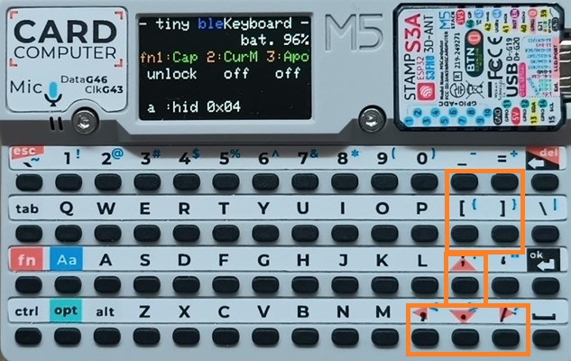

# tiny-bleKeyboard-Cardputer
**[`　English　`](README.md)**

# Cardputer用 Bluetoothキーボード 取扱説明書

## 1. はじめに

このソフトウェア(`tiny-bleKeyboard`)は、M5Stack CardputerをBluetoothキーボードとして使用するためのものです。
すべての印刷キーが実装されています。また、他の便利なキーも実装しています。そのため、Cardputerをほぼ標準の小さなBluetoothキーボードとして使用できます。

主な機能：
*   標準的なキー入力、修飾キー（Shift, Ctrl, Alt, Opt）の送信
*   Fnキーとの組み合わせによる特殊機能
    *   CapsLockのオン/オフ (Fn + 1)
    *   カーソル移動モードのオン/オフ (Fn + 2)
    *   自動電源オフ(APO)時間の設定 (Fn + 3)
*   省電力機能
    *   一定時間無操作で画面輝度低下
    *   設定時間経過でAPO警告後、ディープスリープへ移行
    *   バッテリー残量低下時に警告表示後、ディープスリープへ移行
*   画面表示による状態確認

## 2. 起動と画面表示

### 起動
Cardputerの電源を入れると、ソフトウェアが起動します。
起動時に 'a' キーを押していると、SDカード上のBINファイルのアプリ切替えメニューに以降します。（詳細は「7. アプリの切替え」を参照）。

### 画面表示レイアウト
画面は6行で構成され、以下の情報が表示されます。

*   **L0 (1行目): タイトルとBluetooth接続状態**
    *   例: `- tiny bleKeyboard -`
    *   `ble` の文字色で接続状態を示します (青: 接続中, 赤: 未接続)
*   **L1 (2行目): バッテリー残量**
    *   例: `            bat. 76%`
*   **L2 (3行目): Fnキー機能の案内**
    *   例: `fn1:Cap 2:CurM 3:Apo`
*   **L3 (4行目): Fnキー機能の現在の状態**
    *   CapsLockの状態 (例: `unlock` / `lock`)
    *   カーソル移動モードの状態 (例: `off` / `on`)
    *   APO設定時間 (例: `20min` / `off`)
*   **L4 (5行目): 修飾キーの状態 / 省電力警告**
    *   押されている修飾キー (例: `Shift Ctrl Alt Opt Fn`)
    *   APO警告時: `     SLEEP TIME     ` (点滅)
    *   低バッテリー警告時: `    LOW BATTERY !!  ` (点滅)
*   **L5 (6行目): 送信キー情報**
    *   入力された文字とHIDコード (例: `a`押下時は、`a :hid 0x04`)
    *   特殊キー送信時はHIDコードのみ (例: `ENTER`押下時は、`hid 0x28`)

## 3. 基本的な使い方

### Bluetoothペアリング
1.  Cardputerの電源を入れます。
2.  接続したいPCやスマートフォンなどのホストデバイスでBluetooth設定画面を開き、`ESP32 Keyboard`といったデバイス名を探してペアリングを行ってください。
3.  ペアリングが成功すると、画面L0の `ble` の文字が**赤色から青色**に変わります。

一度ペアリングが完了後は、起動中には接続状態をずっと監視しています。接続が解除したら再接続を試みます。`ble`の色の違いで現在の接続状態を確認することができます。

### キー入力とホストデバイスのドライバについて
Cardputerのキーボードから入力した文字が、ペアリングしたホストデバイス(PC・スマホ等)に送信されます。
ホストデバイスでは、`英語配列用のキーボード・ドライバ`をご使用ください。

`日本語キーボード・ドライバ`を使用の場合は、一部のキャラクターで違いが発生します。
「9.Links:日本語ドライバで英語キーボードを使用」を参考にして対応が必要となります。

### 修飾キー
`Shift`, `Ctrl`, `Alt`, `Opt` ( PC用キーボードの`Win`/`Cmd`キーに相当) キーは、単独または、他のキーと同時に押すことで機能します。押されている修飾キーは画面L4に表示されます。

## 4. Fnキーの機能

Fnキーと特定のキーを同時に押すことで、以下の特殊機能を利用できます。

*   **CapsLock (Fn + 1)**
    *   CapsLockの状態をオン/オフします。
    *   オンになると、画面L3の表示が `unlock` から `lock` (黄色)に変わります。
*   **カーソル移動モード (Fn + 2)**
    *   カーソル移動モードのオン/オフを切り替えます。
    *   オンになると、画面L3の表示が `off` から `on` (黄色)に変わります。
    *   カーソルモードがオンの時は、特定のキーが矢印キーやHome/Endなどのナビゲーションキーとして機能します（詳細は「5. キーマッピング」を参照）。
    *   この設定はディープスリープを挟んでも記憶されます。

カーソル移動モードを活用しますとカーソル移動や文章等の編集が楽になります。 
例えば、 **シフトキーを押しながらカーソルを移動 すると文字や行の選択ができ**、その後は、切り取り・コピー・貼り付け（Ctrl-x/Ctrl-c/Ctrl-v）などが普通キーボードと同じ操作できるようになります。

*   **APO設定 (Fn + 3)**
    *   自動電源オフ(APO)の時間を設定します。押すたびに以下の順で設定が切り替わります。
        *   1分 → 2分 → 3分 → 5分 → 10分 → 15分 → 20分 → 30分 → オフ
    *   画面L3に設定された時間が表示されます (例: `20min`, `off`)。
    *   この設定はNVS（不揮発性メモリ）に保存され、次回起動時にも引き継がれます。

## 5. キーマッピング

* Cardpute上に印刷されているキーは、全て実現しています。

その他にも、次のようなことを実現しています。
* `Opt`キーは、PC用キーボードの`Win`/`Cmd`キー に割当
* `Home`,`End`,`PageUp`,`PageDown`,`PrintScren`,`Insert`キーなどの編集用キーを追加割当
* 日本語IME等でよく使用する　`F5`～`F10`　を追加割当
* 押しっぱなしの時のキー・リピートが可能なことを確認しています。

### Fnキー同時押し時の専用マッピング
**`Fn`キーを押しながら以下のキーを入力**すると、対応するHIDコードが送信されます。

| Cardputerキー | 送信されるキー |
| :------------ | :------------- |
| \` (バッククォート) | ESC            |
| BACKSPACE     | DELETE         |
| 5             | F5             |
| 6             | F6             |
| 7             | F7             |
| 8             | F8             |
| 9             | F9             |
| 0             | F10            |
| ; (セミコロン)  | ↑ (上矢印)    |
| . (ピリオド)    | ↓ (下矢印)    |
| , (カンマ)      | ← (左矢印)    |
| / (スラッシュ)  | → (右矢印)    |
| - (ハイフン)    | Home           |
| [ (左角括弧)    | End            |
| = (イコール)    | Page Up        |
| ] (右角括弧)    | Page Down      |
| \ (バックスラッシュ) | Insert         |
| ' (アポストロフィ) | Print Screen   |

 
＊新規割当キー（`fn` + KEY ）

### カーソル移動モード時のナビゲーションキーマッピング
カーソル移動モードがオンの時（`Fn`キーは押さない）、以下のキーがナビゲーションキーとして機能します。

| Cardputerキー | 送信されるキー |
| :------------ | :------------- |
| ; (セミコロン)  | ↑ (上矢印)    |
| . (ピリオド)    | ↓ (下矢印)    |
| , (カンマ)      | ← (左矢印)    |
| / (スラッシュ)  | → (右矢印)    |
| - (ハイフン)    | Home           |
| [ (左角括弧)    | End            |
| = (イコール)    | Page Up        |
| ] (右角括弧)    | Page Down      |
| \ (バックスラッシュ) | Insert         |
| ' (アポストロフィ) | Print Screen   |

 
＊カーソル移動モード時の割当キー

## 6. 省電力機能

### 輝度低下
最後のキー入力から約40秒経過すると、画面の輝度が低下します。キー入力を行うと通常の輝度に戻ります。

### APO (自動電源オフ)
*   APO設定が "off" 以外の場合、最後のキー入力からAPO設定時間マイナス15秒が経過すると、画面L4に `     SLEEP TIME     ` という警告メッセージが黄色で点滅表示されます。
*   警告表示開始から15秒間キー入力がない場合（APO設定時間に到達した場合）、Cardputerはディープスリープモードに移行します。
*   ディープスリープに移行する直前には、画面に「Entering Sleep」「Press SPACE key to wakeup...」といったメッセージが約5秒間表示されます。

### 低バッテリー警告
*   バッテリー残量が10%以下の状態が3回連続で取得されると、画面L4に `    LOW BATTERY !!  ` という警告メッセージが黄色で点滅表示されます。この警告は他の省電力処理よりも優先されます。
*   警告表示開始から約30秒間キー入力がない場合、Cardputerはディープスリープモードに移行します。
*   ディープスリープに移行する直前には、画面に「Entering Sleep」　「Press SPACE key to wakeup...」といったメッセージが約5秒間表示されます。

### ディープスリープからの復帰
ディープスリープモードからは、Cardputerの`SPACE`キーを押すか、`BtnG0`を押すことで復帰します。

## 7. アプリの切替え

M5Stack-SD-Updaterに対応しています。SDカード上のBINファイルで提供された他のアプリに切替えることができます。

1.  **準備**:
    *   このソフトを提供しているGitHubのBINSフォルダ下のファイル (`menu.bin`など) を用意します。
    *   microSDカードのルートディレクトリに、`menu.bin`およびアプリのBINファイルをコピーします。
2.  **アプリ切替え手順**:
    *   Cardputerの電源がオフの状態で、microSDカードを挿入します。
    *   Cardputerの 'a' キーを押しながら電源を入れます。
    *   SD上の`menu.bin`（M5Stack-SD-Updaterのメニュー画面）が起動するので、画面の指示に従ってファイルを選択してください。
    *   新しいアプリがLoadingされ、完了すると自動的に再起動します。

## 8. その他

### NVS (不揮発性メモリ) への設定保存
以下の設定はCardputer内部のNVSに保存され、電源をオフにしたりディープスリープに入ったりしても保持されます。
*   **APO設定**: Fn + 3 で変更したAPO時間は自動的に保存されます。
*   **カーソルモード設定**: Fn + 2 で変更したカーソルモードのオン/オフ状態は、ディープスリープ移行時に保存され、次回起動（ディープスリープからの復帰時）に復元されます。電源オン時は常にオフから開始されます。

## 9. Links

・[tiny-bleKeyboard-Cardputer：このソフトのgithub](https://github.com/NoRi-230401/tiny-bleKeyboard-Cardputer)

・[M5Stack Cardputerを BLE キーボードにしてみる：ji6czdさん
](https://qiita.com/ji6czd/items/46f155088b3f4519f4d0)

ji6czdさんの記事「そもそもBlueTooth接続ができない？」で回答が得られたのでこのソフト完成することができました。

・[M5 Cardputer を USB キーボードに：しかるのちさん](https://shikarunochi.matrix.jp/?p=5254)

・[M5Cardputer 単体でプログラムの入れ替え：しかるのちさん](https://shikarunochi.matrix.jp/?p=5268)

しかるのちさんの記事でたくさんのCardputerの知見を得ることができました。

・[日本語ドライバで英語キーボードを使用：MAST DESIGNさん](https://mastdesign.me/20240107-jiskeyboard-uskeyboard/)

最初は、日英両方のキーボード・ドライバでもできるように試みていたのですが挫折。最初からこれを使えばよかったんだ。

・[HID Key Code：おなかすいたwiki](https://wiki.onakasuita.org/pukiwiki/?HID%2F%E3%82%AD%E3%83%BC%E3%82%B3%E3%83%BC%E3%83%89)

実は、「HID Key Code」が、なんなの知らなかった。

・[M5Stack-SD-Updater：tobozoさん](https://github.com/tobozo/M5Stack-SD-Updater/)

